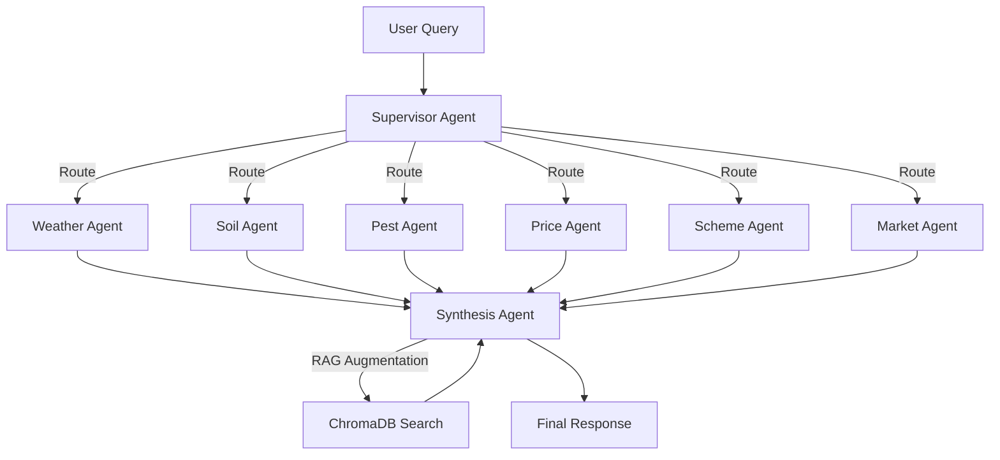

# KrishiVigyan — AI-Powered Smart Agriculture Platform

## 📋 Project Overview

**KrishiVigyan** (कृषि विज्ञान — *Agricultural Science*) is a full-stack AI-powered agricultural intelligence platform designed for Indian (Karnataka-focused) farmers. It integrates real-time environmental data, multi-agent LLM pipelines, and a semantic RAG knowledge base to provide actionable farming intelligence — from land analysis and crop selection to disease forecasting and market strategy.

---

## 🏗 Architecture Overview

```
┌──────────────────────────────────────────────────────────────┐
│                    FRONTEND (React + Vite)                    │
│  ┌──────────┐ ┌────────────┐ ┌──────────┐ ┌──────────────┐  │
│  │ Land     │ │ Crop       │ │ Market   │ │ Vani AI      │  │
│  │ Analyser │ │ Intelligence│ │ Hub      │ │ Chat         │  │
│  └────┬─────┘ └─────┬──────┘ └────┬─────┘ └──────┬───────┘  │
│       │             │             │              │           │
│       └─────────────┼─────────────┼──────────────┘           │
│                     │    Axios + X-Api-Key Header             │
└─────────────────────┼────────────────────────────────────────┘
                      │
┌─────────────────────┼────────────────────────────────────────┐
│                 BACKEND (Flask + Python)                      │
│  ┌──────────────────┼──────────────────────────────────────┐ │
│  │           REST API Layer (Blueprints)                    │ │
│  │  auth | farmer | intelligence | env | market | settings │ │
│  └──────────────────┼──────────────────────────────────────┘ │
│                     │                                        │
│  ┌──────────────────┼──────────────────────────────────────┐ │
│  │         MULTI-AGENT DAG PIPELINE                        │ │
│  │  ┌────────────┐  ┌──────────┐  ┌──────────────┐       │ │
│  │  │ Supervisor │→ │ Specialist│→ │ Synthesis    │       │ │
│  │  │ Agent      │  │ Agents   │  │ Agent        │       │ │
│  │  └────────────┘  └──────────┘  └──────────────┘       │ │
│  │  Agents: weather, soil, pest, price, scheme, market    │ │
│  └────────────────────────────────────────────────────────┘ │
│                     │                                        │
│  ┌─────────────┐ ┌──┴───────────┐ ┌──────────────────────┐ │
│  │ LLM Service │ │ RAG Service  │ │ Weather Service      │ │
│  │ (Groq API)  │ │ (ChromaDB)   │ │ (Open-Meteo API)     │ │
│  └─────────────┘ └──────────────┘ └──────────────────────┘ │
└──────────────────────────────────────────────────────────────┘
```

---

## 🛠 Tech Stack

### Frontend
| Technology | Version | Purpose |
|---|---|---|
| **React** | 18.x | Component-based UI framework |
| **Vite** | 5.x | Build tool and dev server |
| **TailwindCSS** | 3.x | Utility-first CSS framework |
| **Framer Motion** | 11.x | Animation library |
| **Recharts** | 2.x | Data visualization (charts) |
| **Lucide React** | 0.x | Icon system |
| **Axios** | 1.x | HTTP client with interceptors |
| **React Router** | 6.x | Client-side routing |

### Backend
| Technology | Version | Purpose |
|---|---|---|
| **Flask** | 3.x | Lightweight Python web framework |
| **Flask-CORS** | 4.x | Cross-origin request handling |
| **Groq SDK** | 0.x | LLM inference API client |
| **ChromaDB** | 0.x | Vector database for RAG |
| **Sentence Transformers** | 2.x | Text embeddings (all-MiniLM-L6-v2) |
| **python-dotenv** | 1.x | Environment variable management |
| **LangGraph** | 0.x | Multi-agent workflow (optional) |

### AI/ML
| Component | Model/Service | Purpose |
|---|---|---|
| **LLM Provider** | Groq Cloud (llama-3.3-70b-versatile) | Natural language inference |
| **Embeddings** | all-MiniLM-L6-v2 (HuggingFace) | Semantic text similarity for RAG |
| **Vector DB** | ChromaDB (PersistentClient) | Knowledge storage and retrieval |
| **Agent Framework** | LangGraph (or sequential fallback) | Multi-agent DAG orchestration |

---

## 📊 Data Sources

| Source | Type | Used In | Update Frequency |
|---|---|---|---|
| **Open-Meteo API** | Real-time weather (temp, humidity, rainfall, wind, UV) | Land Analyser, Weather Agent, Disease Calculator | Real-time per request |
| **ICAR (Indian Council of Agricultural Research)** | Synthetic + scraped crop research data | RAG Knowledge Base | Pre-indexed at startup |
| **APMC Mandi Data** | Government Minimum Support Prices (MSP) | Market Hub, Price Agent | Static dataset |
| **Government Schemes DB** | PM-Kisan, PMFBY, Soil Health Card etc. | Scheme Agent, RAG | Static dataset |
| **Crop Economics JSON** | Input costs, yield data, market prices | Market Analysis, Land Analyser | Static dataset |
| **Knowledge Core JSONs** | Disease protocols, lifecycle phases per crop | Crop Intelligence, Disease Rules | Pre-indexed |
| **Nominatim (OpenStreetMap)** | Geocoding (city → lat/lon) | City search, GPS | Real-time |

### RAG Collections (ChromaDB)
1. **`crops`** — Lifecycle phases, disease protocols from `knowledge_core_*.json`
2. **`icar`** — ICAR agricultural research data (`synthetic_icar_data.json`, `scraped_icar_data.json`)
3. **`market`** — Crop economics and pricing (`crop_economics.json`)
4. **`schemes`** — Government agricultural schemes (`government_schemes.json`)

---

## 🔑 Key Features

### 1. Land Analyser (`/land-analyser`)
- **GPS + City Search** with AI-corrected autocomplete
- **12-Dimension Crop Scoring**: Temperature, rainfall, pH, water, season, elevation, nutrition, drought tolerance, frost risk, drainage, risk, market
- **Soil Intelligence**: NPK analysis, CEC, organic carbon, micronutrient estimation
- **AI Expert Insights**: LLM-powered analysis with dynamic crop suggestions beyond the pre-configured database
- **7-Day Weather Forecast** from Open-Meteo

### 2. Crop Intelligence Hub (`/crops`)
- **10 Pre-configured Crops** with detailed scientific profiles
- **AI Crop Discovery**: Add any crop via LLM — generates lifecycle, disease rules, and suitability data
- **Disease Risk Models**: Temperature + humidity based disease prediction
- **Cultivation Index**: Real-time suitability scoring based on local conditions

### 3. Vani AI Chat (`/vaniai`)
- **Multi-Agent DAG Pipeline**:
  - Supervisor Agent → routes queries to specialist agents
  - Specialist Agents (weather, soil, pest, price, scheme, market)
  - Synthesis Agent → combines results + RAG context into final response
- **RAG-Augmented**: Searches 4 ChromaDB collections for relevant knowledge
- **Multi-language**: English, Kannada, Telugu, Tamil, Hindi

### 4. Market Hub (`/market`)
- **Real-time MSP & Price Data** for 10+ crops
- **Vendor Finder** with distance-based sorting and commission comparison
- **AI Selling Strategy**: LLM-powered analysis for optimal selling timing, pricing, and market selection
- **Profit Calculator**: Input costs vs. expected revenue

### 5. Smart Environment Scanner (`/scan`)
- **GPS-based environmental scanning**
- **Weather + soil combination analysis**

### 6. Settings (`/settings`)
- **API Key Management** with live test functionality
- **Language & Region Configuration**
- **Cache Management** with privacy controls

---

## 🔒 Security Design

### Zero-Secret Backend Policy
- **API keys are NEVER stored on the backend** — they remain exclusively in browser `localStorage`
- Every request injects the key via `X-Api-Key` HTTP header (Axios interceptor)
- The backend extracts keys from request headers at call time
- Settings file on disk never contains API credentials

### Authentication
- JWT-based auth with `token` stored in `localStorage`
- User profiles stored in SQLite database
- Optional admin role with `/admin` dashboard

---

## 📁 Project Structure

```
6th-sem-main-el/
├── frontend/
│   ├── src/
│   │   ├── App.jsx              # Main app: Navbar, Home, Settings, Routes
│   │   ├── index.css            # Global styles + TailwindCSS
│   │   ├── components/
│   │   │   ├── LandAnalyser.jsx       # GPS + soil + weather analysis
│   │   │   ├── CropIntelligenceHub.jsx # Crop profiles + AI discovery
│   │   │   ├── MarketHub.jsx          # MSP, vendors, selling strategy
│   │   │   ├── VaniAIChat.jsx         # Multi-agent RAG chatbot
│   │   │   ├── SmartEnvironmentScanner.jsx
│   │   │   ├── ProfilePage.jsx
│   │   │   ├── LoginPage.jsx / SignupPage.jsx
│   │   │   └── AdminDashboard.jsx
│   │   └── data/
│   │       └── cropData.js      # Static crop database (10 crops)
│   ├── package.json
│   └── vite.config.js
│
├── backend/
│   ├── app.py                   # Flask app, global LLM helper, chat route
│   ├── services/
│   │   ├── llm_service.py       # Groq API wrapper
│   │   ├── rag_service.py       # ChromaDB RAG (index + search)
│   │   ├── land_analysis_service.py  # 785-line crop scoring engine
│   │   ├── weather_service.py   # Open-Meteo integration
│   │   └── weather_disease_calculator.py
│   ├── agents/
│   │   ├── supervisor_agent.py  # Multi-agent DAG pipeline
│   │   └── specialist_agents.py # Weather, soil, pest, price agents
│   ├── routes/
│   │   ├── intelligence_routes.py  # Land analysis, crops, AI insights
│   │   ├── auth_routes.py
│   │   ├── farmer_routes.py
│   │   ├── env_routes.py
│   │   ├── admin_routes.py
│   │   ├── vendor_routes.py
│   │   └── settings_routes.py
│   ├── core/
│   │   ├── database.py          # SQLite user/crop storage
│   │   └── monitoring.py        # LLM call tracking
│   ├── api/
│   │   └── geocode_api.py       # Nominatim geocoding
│   └── data/
│       ├── knowledge_core_paddy.json
│       ├── knowledge_core_ragi.json
│       ├── synthetic_icar_data.json
│       ├── crop_economics.json
│       ├── government_schemes.json
│       └── chromadb/            # Vector DB persistence
│
├── PROJECT_INFO.md              # This file
├── README.md                    # Quick start guide
└── .env.example                 # Environment variable template
```

---

## 🚀 Getting Started

### Prerequisites
- Node.js 18+ and npm
- Python 3.10+
- A free Groq API key from [console.groq.com](https://console.groq.com/keys)

### Backend Setup
```bash
cd backend
pip install -r requirements.txt
python app.py
# Server starts on http://localhost:5001
```

### Frontend Setup
```bash
cd frontend
npm install
npm run dev
# App starts on http://localhost:5173
```

### Configuration
1. Open the app in your browser
2. Go to **Settings** → **Groq API Key**
3. Paste your `gsk_...` key and click **Save**
4. Click **Test** to verify the connection

---

## 🔄 API Endpoints Reference

### Authentication
| Method | Endpoint | Description |
|---|---|---|
| POST | `/api/auth/signup` | Register new user |
| POST | `/api/auth/login` | Login and get JWT |

### Intelligence
| Method | Endpoint | Description |
|---|---|---|
| POST | `/api/diagnostics/location` | Full land analysis (GPS/city) |
| POST | `/api/land/ai-insights` | LLM-powered land strategy |
| POST | `/api/crops/add-custom` | AI-generate a new crop profile |
| GET | `/api/crops/custom` | List user-added crops |
| GET | `/api/cities?q=...` | City autocomplete with AI correction |

### Chat
| Method | Endpoint | Description |
|---|---|---|
| POST | `/api/chat` | Vani AI multi-agent chat |

### Market
| Method | Endpoint | Description |
|---|---|---|
| POST | `/api/market/analysis` | Crop market analysis |
| POST | `/api/market/ai-insights` | AI selling strategy |

### Settings
| Method | Endpoint | Description |
|---|---|---|
| GET | `/api/settings` | Get user settings |
| POST | `/api/settings` | Update settings |
| POST | `/api/settings/test-key` | Test Groq API key validity |

---

## 🧠 Multi-Agent Pipeline (Vani AI)



1. **Supervisor** analyzes the query and selects relevant specialist agents
2. **Specialists** each produce a focused data report
3. **Synthesis** combines all reports + RAG context into a comprehensive response
4. Falls back to direct LLM + RAG if the pipeline fails

---

## 🔧 Troubleshooting

| Issue | Solution |
|---|---|
| AI features return errors | Check API key in Settings → Test button |
| RAG returns empty results | Delete `backend/data/chromadb/` and restart backend |
| GPS not working | Allow location access in browser settings |
| City search fails | Try spelling variations; AI correction handles common misspellings |
| Custom crop shows blank page | Ensure the backend returned all required fields |
| Backend won't start | Check `pip install -r requirements.txt` completed without errors |

---

## 📈 Future Improvements

1. **Satellite Imagery Integration** — Use Sentinel-2/NDVI data for real crop health monitoring
2. **IoT Sensor Integration** — Connect to soil moisture and weather station hardware
3. **Yield Prediction ML Model** — Train on historical Karnataka crop yield data
4. **Multi-Farm Management** — Support for multiple land parcels per user
5. **Offline Mode** — PWA with service worker for areas with poor connectivity
6. **WhatsApp Integration** — Vani AI via WhatsApp Business API for wider farmer reach
7. **Price Prediction** — Time-series forecasting (LSTM/Prophet) for mandi prices
8. **Community Features** — Farmer-to-farmer Q&A and marketplace
9. **Government API Integration** — Direct integration with e-NAM and AgMarkNet
10. **Drone Mapping** — Integration with drone surveys for precise field mapping

---

## 👥 Credits

- **Data Sources**: ICAR, Open-Meteo, APMC Karnataka, OpenStreetMap Nominatim
- **AI Infrastructure**: Groq Cloud (Llama 3.3 70B), HuggingFace Sentence Transformers
- **Vector Database**: ChromaDB
- **Framework**: React + Vite (Frontend), Flask (Backend)

---

*Last updated: May 2026*
