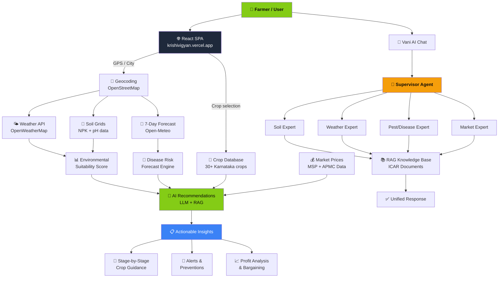

# KrishiVigyan — AI-Powered Farming Intelligence

[](https://krishivigyan.vercel.app)
[](https://www.python.org/downloads/)
[](https://reactjs.org/)
[](https://opensource.org/licenses/MIT)

**KrishiVigyan** is a full-stack agricultural intelligence platform that delivers AI-powered crop recommendations, land analysis, weather forecasts, market prices, and disease detection — built for Karnataka farmers.

**Live**: [krishivigyan.vercel.app](https://krishivigyan.vercel.app)

---

## Features

### Vani AI Chat
Multi-agent AI assistant (Supervisor + specialist agents) for farming questions, disease diagnosis, and government scheme info. Supports Kannada language.

### Land Analyser
GPS-powered soil analysis, water availability scoring, and crop suitability assessment with animated step-by-step processing.

### Crop Intelligence Hub
AI-powered lifecycle management, predictive disease forecasting, and stage-by-stage guidance for 30+ Karnataka crops.

### Market Hub
Real-time market prices, MSP forecasts, logistics cost modeling, and profit analysis with a bargaining bot.

### Smart Scan
AI-powered disease detection from crop photos.

### Environmental Diagnostics
Real-time weather data, 7-day forecasts, NPK soil analysis, and water availability index.

---

## Tech Stack

| Layer | Technology |
|---|---|
| **Frontend** | React 18, Vite, Tailwind CSS, Framer Motion, Recharts |
| **Backend** | Flask, PostgreSQL, SQLAlchemy |
| **AI/LLM** | OpenRouter gateway (multi-model), RAG with ICAR knowledge base |
| **Maps** | OpenStreetMap / Nominatim geocoding |
| **Weather** | OpenWeatherMap, Open-Meteo |
| **Deployment** | Frontend on Vercel, Backend on Render, Neon PostgreSQL |

---

## Methodology



### Architecture

```
User → krishivigyan.vercel.app (Vercel SPA)
                ↓
         Vercel Rewrite (/api/*)
                ↓
    ai-farm-advisor.onrender.com (Flask)
                ↓
        ┌───────┴───────┐
     PostgreSQL     LLM Service
     (Neon)      (OpenRouter)
```

- Frontend serves as a static SPA with API calls proxied through Vercel rewrites
- Backend is a Flask REST API on Render (free tier, cold-starts after inactivity)
- LLMService/RAGService use a singleton pattern shared across agents
- Persistent storage via Neon PostgreSQL (survives Render restarts)

---

## Setup

### Backend

```bash
git clone https://github.com/Tharungowdapr/ai-farm-advisor-.git
cd ai-farm-advisor-/backend
python -m venv venv
source venv/bin/activate
pip install -r requirements.txt
cp .env.example .env   # add your API keys
python app.py
```

### Frontend

```bash
cd ../frontend
npm install
npm run dev
```

---

## Environment Variables

| Variable | Required | Description |
|---|---|---|
| `OPENROUTER_API_KEY` | Yes | OpenRouter API key for LLM access |
| `SECRET_KEY` | No | Fernet key for API key encryption at rest |
| `DATABASE_URL` | No | PostgreSQL URL (uses SQLite file if not set) |
| `CORS_ORIGINS` | No | Comma-separated allowed origins for CORS |

---

## Deployment

- **Frontend**: Auto-deploys to Vercel from `frontend/` directory on push to `main`
- **Backend**: Auto-deploys to Render from `backend/` directory on push to `main`
- **Database**: Neon PostgreSQL (free tier, serverless)

---

## License

MIT
